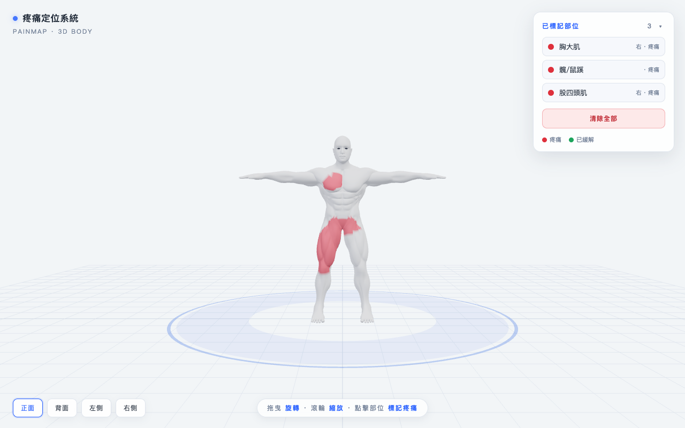

# RehabMate · 復健幫手

A tiny, self-contained **3D body pain-mapping tool** for rehab / physiotherapy clinics.
A patient rotates an anatomical body, taps the muscles that hurt, and the doctor reads a clean list of marked areas — so "it hurts *here*" becomes a shared, precise picture instead of a vague gesture.

**Live demo:** https://rehab-body-map.vercel.app



---

## What it does

- **Rotate a real muscular 3D body** — drag to orbit, pinch/scroll to zoom, one-tap front / back / left / right views.
- **Tap a muscle → it fills in.** Each muscle group is its own region and fills cleanly (paint-bucket style, no overflow). Tap again → green (relieved), a third tap → clear.
- **~40 named muscle groups**, front and back independent (chest vs. upper back, quads vs. hamstrings, etc.).
- **Live summary panel** listing every marked area (muscle · side · pain/relieved) for the clinician.
- **Works on phones.** Collapsible summary sheet keeps the body fully visible; touch-tuned controls.
- **One file, no build, no backend.** Just `index.html` + a model. Open it and it runs.

## Why it exists

In a rehab consult the patient often can't name the muscle, and pointing at their own body across a desk is imprecise. RehabMate gives both people the same rotatable model to point at, and turns the pointing into a written record.

## Run it

Any static file server works — there is no build step.

```bash
# clone, then from the repo root:
python3 -m http.server 8000
# open http://localhost:8000
```

Or drop the folder onto any static host (Vercel, Netlify, GitHub Pages, an intranet box).

## How it works (for anyone extending it)

- **Rendering:** [three.js](https://threejs.org) (loaded from a CDN via import-map). One `<script type="module">` in `index.html`, no bundler.
- **Muscle regions:** the body is a single mesh. On load, every vertex is assigned to its nearest anatomical zone (see the `MUSCLES` array in `index.html`). Tapping a muscle recolors *all* of that region's vertices at once — that's the clean, bounded fill.
- **Editing the muscle map:** each entry in `MUSCLES` is `[name, side, x, y, z, rx, ry, rz]` — a labelled zone centre plus per-axis reach. Move a centre or widen a radius and that region's coverage changes. Front zones use `z > 0`, back zones `z < 0`, which keeps front/back muscles independent.
- **Swapping the model:** replace `assets/body.glb` with any single-mesh humanoid GLB and re-check the `MUSCLES` coordinates against its proportions.

## Credits & licence

- **Code:** MIT © 2026 — see [LICENSE](LICENSE).
- **3D model:** *"Male base muscular anatomy"* by **[CharacterZone](https://sketchfab.com/CharacterZone)**, licensed **[CC BY 4.0](http://creativecommons.org/licenses/by/4.0/)** via Sketchfab. The model file (`assets/body.glb`) is redistributed here under that licence with attribution — see [ATTRIBUTION.md](ATTRIBUTION.md).

Not a medical device. It records where a patient says it hurts; it does not diagnose.
